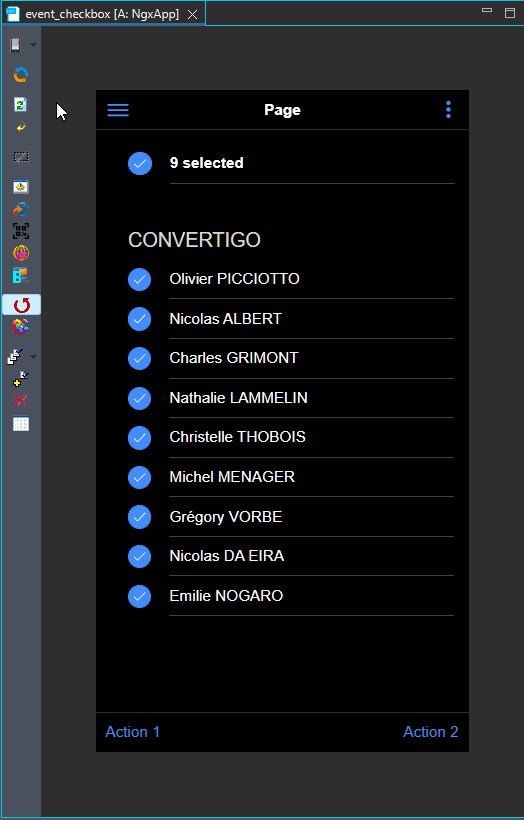

#  event_checkbox

How to set events on checkboxes

<i>Connectors</i>
<blockquote>

##  void

void connector, replace or don't use it

<i>Transactions</i>
<blockquote>

###  void

does nothing

</blockquote>

</blockquote>

<i>Sequences</i>
<blockquote>

##  getList

</blockquote>

<i>Mobile Application</i>
<blockquote>

##  Application

Describes the mobile application global properties

<i>Pages</i>
<blockquote>

###  Page

<h1>Checkboxes events</h1>
<ul>
<li>All checkboxes are checked when entering the page (<b>masterCheck</b> binding).</li>
<li>Each checkbox has a Click and Change events.</li>
<li>'Select all' master checkbox counts checked checkboxes.</li>
<li>Indeterminate master checkbox property is evaluated each time other checkboxes state change.</li>
</ul>

</blockquote>

</blockquote>

