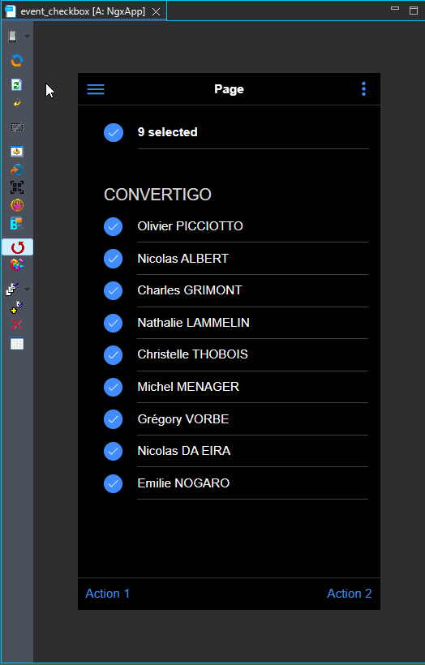

# event_checkbox

How to set events on checkboxes


For more technical informations : [documentation](./project.md)

- [Installation](#installation)
- [Mobile Application](#mobile-application)
    - [Pages](#pages)
        - [Page](#page)


## Installation

1. In your Convertigo Studio click on  to import a project in the treeview
2. In the import wizard

   
   
   paste the text below into the `Project remote URL` field:
   <table>
     <tr><td>Usage</td><td>Click the copy button at the end of the line</td></tr>
     <tr><td>To contribute</td><td>

     ```
     event_checkbox=https://github.com/convertigo/c8oprj-sample-event-checkbox.git:branch=master
     ```
     </td></tr>
     <tr><td>To simply use</td><td>

     ```
     event_checkbox=https://github.com/convertigo/c8oprj-sample-event-checkbox/archive/master.zip
     ```
     </td></tr>
    </table>
3. Click the `Finish` button. This will automatically import the __event_checkbox__ project


## Mobile Application

Describes the mobile application global properties

### Pages

#### Page

<h1>Checkboxes events</h1>
<ul>
<li>All checkboxes are checked when entering the page (<b>masterCheck</b> binding).</li>
<li>Each checkbox has a Click and Change events.</li>
<li>'Select all' master checkbox counts checked checkboxes.</li>
<li>Indeterminate master checkbox property is evaluated each time other checkboxes state change.</li>
</ul>



